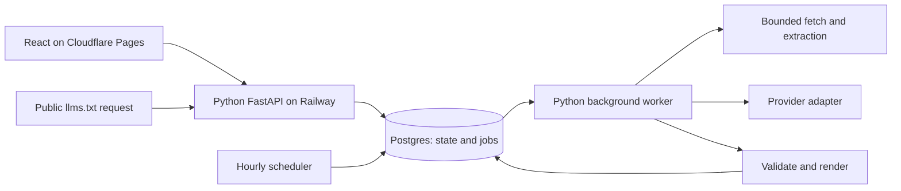

# Brief: implemented architecture and remaining work

Status: the Python API, Postgres migrations/job lifecycle, crawler, source snapshots, refresh diffing, scheduler command, domain functions, OpenAI generation, document versions, and eval harness are implemented. The React editor, persisted decisions, optional question flow, manual Markdown editing, and version review are also implemented. Explicit saved-version publication, existing-guide checks, and the change inbox are implemented; cloud deployment remains planned. Provider: OpenAI Responses API, GPT-6 Sol, medium reasoning.

## Architecture decision

The implemented runtime is a TypeScript React/Vite frontend and Python backend. Cloudflare Pages and Railway are planned deployment targets; the backend remains portable. Run FastAPI as an HTTP service, a separate Python worker process for crawling/model jobs, and Postgres for project state and a small durable job queue. A Railway cron process inserts due refresh jobs and exits. The browser receives Server-Sent Events with a polling fallback; see [live progress](docs/LIVE_PROGRESS.md). No agent framework or vector database is needed for the first build.

Keep the crawl and model stages independently observable. Crawl completion atomically enqueues a separate generation job pinned to that snapshot, so model retries reuse evidence. Initial output becomes a draft. Decision changes rebuild the draft from active decisions; source refreshes create review proposals. Each generation job freezes its source and decision inputs. The durable worker owns retries and leases; FastAPI request-bound background tasks are not the durable job mechanism. Start with a Postgres queue to avoid an additional broker. If job volume or scheduling complexity grows, replace it with an established job library without changing domain functions.

Relevant primary documentation: [Railway FastAPI deployment](https://docs.railway.com/guides/fastapi), [Railway backend services and workers](https://docs.railway.com/guides/saas-backend), [FastAPI background task guidance](https://fastapi.tiangolo.com/tutorial/background-tasks/), and [Postgres SELECT / SKIP LOCKED](https://www.postgresql.org/docs/current/sql-select.html). The queue design below is our application design, not a claim that FastAPI provides these durability guarantees.

## Core boundary: decisions are state; chat is history

Generate from a crawl snapshot, active decisions, dismissed question topics, and an explicit task. Do not reconstruct authority by replaying conversation history. Every model result has a complete structured guide or, for question-only requests, no guide. Render Markdown in application code.

- A source is a stable ID, verified URL, title, description, and bounded extracted content. The schema supports a Markdown alternative; automatic discovery and verification of alternatives is not implemented.
- A decision is a fact or editorial preference with an active flag and provenance. Persist decision revisions; snapshots record the precise revisions used.
- A pending question carries a stable topic, a short rationale, options, a recommendation, and evidence IDs. The user can also answer freely.
- A generation result contains the guide, a short explanation, and zero to three questions. “Keep grilling me” uses a one-question budget per turn, with no lifetime limit.
- A document version records its source snapshot ID, frozen generation input (including decisions), decision revision, model/prompt metadata, structured guide, rendered bytes, and whether the user edited it directly.

The current `build_request` excludes inactive decisions. On decision deletion, regenerate from source evidence and the remaining active decisions, never the old generated draft. The UI must explain that regeneration replaces manual wording; preserve the prior document version for recovery. A removed claim may still appear if independently supported by the website. Removal withdraws an instruction; exclusion requires an active exclusion preference.

Free text needs a separate, bounded interpretation step: return proposed decision operations and/or an editing intent. Validate IDs and permitted operations in code. Show ambiguous or consequential changes as option cards. Clear requests such as “omit pricing” can become active preferences immediately, with undo. User-supplied facts retain decision provenance. Neither chat nor a model tool call may invoke publication directly.

This interpretation step and targeted document editing are planned, not implemented by the current generation schema.

## Generation pipeline

1. Validate the submitted URL and establish crawl scope.
2. Crawl and normalize source evidence, retaining fetch outcomes and extraction warnings.
3. Freeze current active decisions with the source snapshot. Refresh generation also uses current saved decisions and creates a private proposal; it does not regenerate or publish from an older published decision snapshot.
4. Make one bounded model call through a provider-neutral adapter.
5. Parse the structured result, validate source and evidence IDs, question budget, duplicate links, and question-only behavior.
6. Render the guide with escaped text and source-owned HTTP(S) destinations.
7. Save an immutable version. Atomically update the draft pointer if its expected revision is still current.

The initial adapter does not automatically repair invalid output: schema/source failures terminate the generation job and preserve the previous version. Transient network/server errors retry through the durable job system; credential, quota, refusal, and incomplete-output failures are terminal and can be explicitly retried after correction. Retry transient provider failures separately from schema failures. Keep an overall job deadline and bounded crawl, content, and output-token budgets. Record attempts so a successful-looking repair does not hide first-attempt failure rates.

The model boundary returns JSON, not arbitrary Markdown or executable actions. Evidence IDs establish traceability, not factual entailment: semantic review still matters. Website content is untrusted data. The prompt instructs the model to ignore embedded instructions; evals test that behavior. API keys remain backend environment secrets and never enter browser requests, stored source text, or eval artifacts.

The renderer follows the [llms.txt proposal](https://llmstxt.org/): H1, optional blockquote summary, optional context, then H2 resource lists. Only H1 is mandatory in that proposal; our quality checks are stricter product expectations, not claims about universal format compliance. Do not promise search ranking, citation, or ingestion by any particular assistant.

## Crawl boundary

Implemented with aiohttp fetching and Trafilatura extraction, without browser rendering. Discover from the supplied page, same-scope links, and a bounded sitemap. There is no default page-count limit. Fetch in batches of four, respecting per-origin robots rules and at least 250 ms between request starts. A 120-second deadline, 50 MB download budget, 300,000-character evidence budget, and per-request limits bound each crawl. Production jobs use an initial sample and a model-guided coverage assessment to select further reading. Refreshes reuse saved page selections while owner direction is unchanged and recheck existing sources. See [crawl coverage](docs/CRAWL_COVERAGE.md) and [saved discovery](docs/DISCOVERY_INVENTORY.md). Show crawl coverage and JS-only/extraction failures to the user.

Normalize main content before hashing; exclude navigation and recurring layout where extraction can identify them. Hash title, description, and meaningful content. Whitespace-only changes should not regenerate. Broad timestamp stripping can hide real changes and should be fixture-tested before introduction. Crawl omissions are not removals. Only two separate explicit 404/410 observations remove a known page; 429, 5xx, timeouts, and extraction failures preserve it. A successful fetch resets the not-found count. Current logic counts explicit not-found observations, even if separated by an unavailable observation.

URL fetching is a security boundary: permit HTTP(S), reject credentials and local/private/reserved destinations, restrict ports and scope, and revalidate every redirect. String-level hostname checks alone do not address DNS rebinding. The implemented fetch boundary validates the addresses returned to the connector and again at socket creation, disables environment proxies, and manually revalidates redirects. Tests cover private DNS answers, literal IPs, redirect rejection, and bounded response reads. Public rollout still needs deployment-level egress review and quotas. Apply request quotas and crawl rate limits. Treat robots rules and inaccessible pages as coverage restrictions, not an invitation to bypass them.

### Crawling library choice

| Option | Decision for this slice |
| --- | --- |
| [Trafilatura](https://trafilatura.readthedocs.io/en/latest/usage-python.html) + [aiohttp](https://docs.aiohttp.org/en/stable/client_advanced.html) | Chosen. Reuse content/metadata extraction; retain explicit network policy, crawl budgets, and source reconciliation. No paid API or browser installation. |
| [Crawlee](https://crawlee.dev/python/docs/quick-start) | Good broader crawler abstraction, including a Playwright path. Its lifecycle/storage overlaps our job system; defer unless browser rendering becomes essential. |
| [Firecrawl](https://www.firecrawl.dev/crawl) | A hosted crawl API is a useful future fallback. It introduces credentials and usage cost; self-hosting adds services we do not need for the initial path. |

Live smoke tests exposed price-only extraction on a catalog and incorrect UTF-8 metadata decoding. The extractor now uses Trafilatura's encoding-aware parser, selectively retries short link-heavy content in recall mode, and prioritizes main/article links. Frozen regression fixtures cover those behaviors. The recall fallback can include more noise, so source coverage and editorial quality still require evaluation.

## Data and consistency

The [SQL migrations](src/brief/migrations/) are the authoritative schema. Current application tables are:

| Tables | Stored state |
| --- | --- |
| `sites`, `projects` | Shared site identity; each scoped guide's access token hash, revision, draft/proposal/published pointers, publication ID, and monitoring settings |
| `crawl_snapshots` | Bounded sources, page state, observations, coverage, warnings, and changes as JSONB |
| `decisions`, `decision_events`, `questions` | Active facts/preferences, revision history, evidence basis, and optional questions |
| `document_versions` | Immutable Markdown, structured output, frozen generation input, source snapshot, manual-edit flag, model/prompt metadata |
| `jobs` | Kind, idempotency key, frozen generation input, expected revision, progress, attempts, lease token/expiry, result/error |
| `page_cache`, `discovery_frontiers`, `model_cache` | Shared page evidence, saved discovery work, and reusable model responses |
| `guide_test_suites`, `guide_test_runs` | Saved visitor questions and versioned reader-test results |

There are no separate `pages`, `decision_revisions`, or `decision_snapshots` tables.
Decision inputs are frozen inside generation jobs and document versions.

Store only bounded evidence initially. Add object storage if measured source volume warrants it, instead of saving unlimited HTML in Postgres. Define retention for superseded snapshots without deleting evidence referenced by retained versions.

Treat jobs as at-least-once execution. A crash after a provider response but before database commit can incur a duplicate model call on retry; the unique document-per-job constraint prevents duplicate saved versions, not duplicate provider charges. Insert a job with a unique idempotency key in the same transaction as the state change that requested it. The worker claims a pending or expired job using a short `SELECT … FOR UPDATE SKIP LOCKED` transaction, assigns a lease token and expiry, then commits before network work. Do not hold a database transaction open during crawling or generation.

Completion must match the lease token and expected project revision. A worker whose lease expired cannot commit, even if its model call finishes later. Completed jobs cannot be reclaimed. Concurrent user edits cause a stale result to become a reviewable version or be superseded, never replace newer state. Renew leases for bounded long jobs; cap attempts and apply backoff before a terminal failed state.

An hourly cron process inserts jobs for projects whose daily refresh is due, using a unique project-and-due-period key so repeated scheduler runs are harmless. Expired jobs are recovered by the worker. Unlike a separate broker, the initial Postgres queue has no database-to-broker dual-write gap. This simplicity comes with explicit responsibility to implement and integration-test job claiming, lease fencing, retries, and recovery.

Publication atomically moves the published version pointer, guarded by project revision. That immutable version retains its generation input and decision snapshot. Refresh continues to use current saved decisions and produces private proposals; automatic publication is not implemented. Public requests serve only the stored published bytes. No model generation occurs on a public file request.

## Refresh and publication

Manual checks and the scheduler enqueue refresh jobs. Unusable crawls preserve the
last usable evidence and publication. Unchanged sources with an existing draft
skip generation. Changed sources produce a private proposal while retaining the
current draft; changed evidence can flag saved decisions for review. Accepting a
proposal and publishing it are explicit owner actions guarded by revisions.

The pure `refresh_action` helper in [refresh.py](src/brief/refresh.py) models a
broader policy, including a possible automatic-publish outcome. That policy is
not wired into automatic publication. Current worker refreshes never update the
public file automatically. Automatic publication, three-way merging, and email
notifications remain future work.

A downloaded copy on the owner's domain does not follow changes to Brief's hosted
URL. Installation verification compares the owner's served file with the selected
publication; it does not deploy it.

## HTTP and access

The running [OpenAPI reference](http://localhost:8000/docs) documents exact request
bodies and responses. Representative implemented routes are:

| Route | Purpose |
| --- | --- |
| `POST /api/projects` | Create a project and enqueue its initial crawl; successful crawling queues generation when configured |
| `GET /api/projects/{id}` | Authenticated state, versions, questions, and job status |
| `POST /api/projects/{id}/decisions` | Save a decision and enqueue regeneration |
| `PATCH /api/projects/{id}/decisions/{decision_id}` | Revise/deactivate a decision |
| `POST /api/projects/{id}/questions` | Request another optional question |
| `POST /api/projects/{id}/versions` | Save a direct edit with expected revision |
| `POST /api/projects/{id}/versions/{version_id}/use` | Use a saved version as the draft |
| `POST /api/projects/{id}/publication` | Publish a selected saved version or unpublish |
| `GET /api/published/{publication_id}/llms.txt` | Serve public plain text with ETag |
| `POST /api/projects/{id}/refresh` | Enqueue a deduplicated source check |
| `POST /api/projects/{id}/tests` | Queue a reader test of a guide version |

General free-text message interpretation is planned; there is no `/messages` endpoint.

The current API generates a cryptographically random management token and stores only its hash; project routes support bearer authentication and project-scoped HttpOnly cookies. The frontend exchanges the management secret for a cookie (Secure in production). The UI keeps the secret out of public URLs, logs, and referrers through a fragment-based recovery link cleared after exchange. Scope every query to the authenticated project. The current development API uses exact-origin CORS and an optional private-demo creation key. Cookie-authenticated mutations enforce exact Origin checks; public deployment needs quotas on creation and model-triggering endpoints. No signup is required; possession of the management link grants editing access.

Prefer custom sibling domains (`app.example.com` on Pages, `api.example.com` on Railway), allowing same-site cookies while configuring credentialed CORS for the exact frontend origin. For a demo using default unrelated `pages.dev` and `railway.app` domains, proxy `/api` through a narrow Pages Function to the Python API so cookie auth remains same-origin; do not rely on third-party cookies. The proxy only forwards approved API paths to a fixed backend origin, never arbitrary user destinations. Preview deployments need explicitly scoped API access; never use wildcard credentialed CORS. The Python API owns authorization in both arrangements.

Deploy one Python package with distinct API, worker, and scheduler entry points. Use managed Postgres and versioned migrations, backend-only secrets, structured logs, and health checks. Pages deploys static frontend assets. A staging smoke test must verify real database transactions, duplicate job claims, concurrent publication, schedule dispatch, authentication across domains, and last-good-file preservation; local domain tests cannot establish these properties.

## Evaluation and remaining work

The original harness has nine frozen synthetic scenarios and can export requests,
grade saved JSON responses, or invoke a model adapter. Expanded studies add real
files, routing tasks, frozen page evidence, consumer navigation, and refresh
fixtures. See [the evaluation guide](evals/README.md) for commands and boundaries.
A passing model-input fixture does not establish end-to-end live-site coverage.
The [URL-to-file benchmark](evals/end_to_end.md) separately replays 12 authored
HTTP sites through crawl, extraction, validation, and rendering. Its deterministic
baseline exposes coverage gaps without measuring model editorial quality.

The [September 24 study](evals/REPORT.md) collected 55 actual files across 13
categories, eight templates, 97 routing questions, and 54 generation cases (23
with fetched page evidence). The frozen v2 prompt passed 162 repeated deterministic
checks after documented label corrections. The application now uses
`brief-generation-v5`; those historical scores must not be presented as validation
of the current prompt. Raw model results remain local and gitignored.

Implemented product flows include URL-to-draft generation, persisted decisions,
manual editing, version comparison, reader tests, scoped guides, explicit
publication, installation checks, existing-guide discovery, and source-change
review. The [README walkthrough](README.md#five-minute-reviewer-walkthrough)
connects these into a short reviewer journey.

Remaining work includes broader end-to-end website benchmarks, current-prompt
model runs, independent human calibration, browser-rendered/PDF extraction, and
cloud deployment validation. Keep crawl coverage, deterministic output validity,
semantic accuracy, and reader usefulness as separate measurements. None of the
existing studies establishes search ranking gains or adoption by answer engines.
