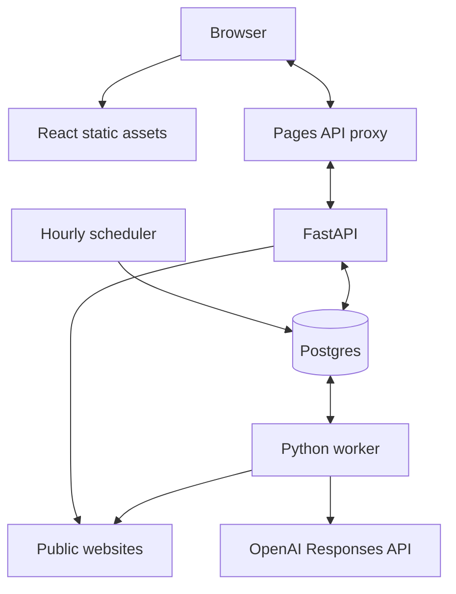

# Architecture

Brief is a React editor backed by FastAPI, a Python worker, and Postgres. The
[public demo](https://brief-llms-txt.pages.dev/) runs on Cloudflare Pages and
Railway. Postgres holds application state and the durable job queue; no separate
message broker is used.

## Deployed runtime

Cloudflare Pages hosts the static assets and proxy. Railway runs the API,
worker, scheduler, and Postgres.

The browser uses one origin. The [Pages proxy](frontend/public/_worker.js)
forwards `/api/*` and `/health` to Railway, preserving cookies and streaming
responses while disabling API caching. Published `llms.txt` files use this same
API path; FastAPI serves their saved contents without a model call.

The API handles access, edits, publication, and job submission. The worker runs
crawls, generation, and reader tests. It records progress in Postgres; the API
streams updates through Server-Sent Events. The browser falls back to polling
when that stream is unavailable.

**The scheduler runs hourly; monitored projects are checked daily.** It queues
projects whose `next_check_at` is due, moves that time forward one day, then exits.
The worker executes the queued checks. Per-project hourly refreshes are not
currently configurable.

For local development, Vite proxies API requests to FastAPI. The optional
`BRIEF_EMBEDDED_WORKER=true` mode runs the worker on a separate thread inside a
single API process and delivers progress through memory queues. It still uses
Postgres for durable state. The deployed demo uses a separate worker service.
See [deployment](docs/DEPLOYMENT.md) and [live progress](docs/LIVE_PROGRESS.md).

## From URL to published guide

1. **Create:** the API saves a site and its first scoped guide, then queues a crawl.
2. **Collect:** the worker fetches pages with aiohttp and extracts main content
   with Trafilatura. It saves evidence, coverage, warnings, and source changes.
3. **Generate:** a usable crawl can queue a separate generation job. That job
   freezes its source snapshot and active owner decisions. OpenAI returns
   structured data; application code validates references and renders Markdown.
4. **Review:** the first result becomes a draft. Owner decisions can regenerate
   it, and manual edits create saved versions. Changed website evidence produces
   a proposal for review; unchanged evidence with an existing draft skips generation.
5. **Publish:** the owner selects a saved version. Publication updates a pointer
   to those exact bytes. Later edits and refreshes do not change the public file
   until the owner publishes again.

Decisions are explicit facts and preferences, not instructions reconstructed
from chat history. Versions retain their source snapshot, decision inputs, and
model metadata. Invalid model output or a failed crawl preserves previous usable
state. Installation verification compares a file on the owner's website with
Brief's published version; it does not install that file.

## State and consistency

A site can contain several path-scoped guides. They share site access and a page
cache while retaining independent decisions and document history.

| State | Tables |
| --- | --- |
| Sites, scoped guides, monitoring and version pointers | `sites`, `projects` |
| Evidence, fetch outcomes, coverage and changes | `crawl_snapshots` |
| Owner direction and follow-up questions | `decisions`, `decision_events`, `questions` |
| Saved generated and manually edited documents | `document_versions` |
| Durable work, retries, leases and progress | `jobs` |
| Reusable evidence, discovery and model responses | `page_cache`, `discovery_frontiers`, `model_cache` |
| Reader-test inputs and results | `guide_test_suites`, `guide_test_runs` |

The [migrations](src/brief/migrations/) define the schema. Jobs are claimed with
`FOR UPDATE SKIP LOCKED` and a renewable lease. Network work happens outside the
claim transaction. Completion checks the lease and relevant revisions so a stale
worker cannot overwrite newer state. Idempotency keys deduplicate requests, and
retries use bounded attempts and backoff.

Execution is at least once: a crash after a model response can cause a repeated
provider call. A unique document-per-job constraint prevents duplicate saved
versions, but cannot prevent duplicate provider charges.

## Boundaries and limitations

- **Fetching:** HTTP(S) only, scoped URLs, robots rules, redirect checks, and
  public-address validation at DNS resolution and socket creation. Cross-domain
  redirects outside scope are reported with a destination users can submit as
  a new brief. JavaScript rendering and PDF extraction are not implemented.
- **Coverage:** crawls have time, download, and evidence budgets. Model-assisted
  page selection improves coverage but does not guarantee completeness. A
  timeout or omitted page is not a deletion; removing a known page requires two
  explicit 404/410 observations. See [crawl coverage](docs/CRAWL_COVERAGE.md).
- **Access:** anyone can create a project on the demo. Editing requires its
  management token or site-scoped HttpOnly cookie. Production cookies are
  Secure, and cookie-authenticated mutations check the request origin. Tokens
  are hashed in Postgres; private recovery links carry the secret in a fragment
  that the browser clears after exchange. There are no user accounts or
  per-user quotas.
- **Model output:** source IDs and schema checks constrain the output, but do
  not prove factual accuracy or usefulness. Website content is untrusted input.
  API keys stay in the backend environment.
- **Publication:** acceptance and publication are owner actions. Automatic
  publishing, three-way merging, and email notifications are not implemented.

Tests cover job recovery, authorization, source reconciliation, versioning, and
browser flows. [Evaluations](evals/README.md) separately measure crawl coverage,
output validity, and reader usefulness; historical prompt scores do not validate
newer prompts or establish performance across all live websites.
