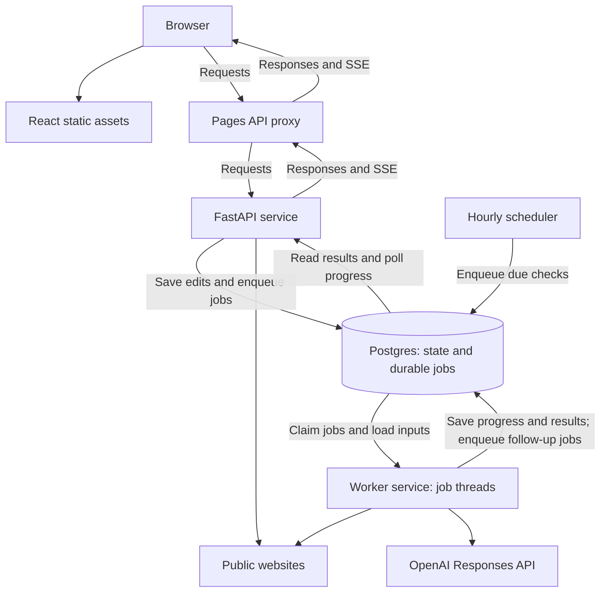
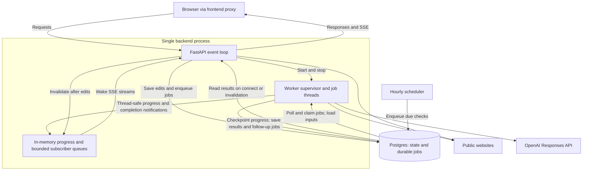

# Architecture

Brief is a React editor backed by FastAPI, a Python worker, and Postgres. The
[public demo](https://brief-llms-txt.pages.dev/) runs on Cloudflare Pages and
Railway. Postgres holds application state and the durable job queue; no separate
message broker is used.

## Deployed runtime

Separate services (current deployed demo):

Embedded mode (optional single-process deployment):

Both modes use SQL for job dispatch and recovery. The embedded memory queues
carry live updates to the API; they do not replace the durable job queue.

Cloudflare Pages hosts the static assets and proxy. Railway runs the API,
worker, scheduler, and Postgres.

The browser uses one origin. The [Pages proxy](frontend/public/_worker.js)
forwards `/api/*` and `/health` to Railway, preserving cookies and streaming
responses while disabling API caching. Published `llms.txt` files use this same
API path; FastAPI serves their saved contents without a model call.

FastAPI hands work to the worker through the Postgres job queue, not a direct
HTTP call. The API inserts a job; the worker polls the queue, claims it, and saves
progress and results back to Postgres. The API reads that state and streams
updates to the browser through Server-Sent Events, with polling as a fallback.
The worker handles crawls, generation, and reader tests; the API handles access,
edits, and publication.

**The scheduler runs hourly; monitored projects are checked daily.** It queues
projects whose `next_check_at` is due, moves that time forward one day, then exits.
The worker executes the queued checks. Per-project hourly refreshes are not
currently configurable.

For local development, Vite proxies API requests to FastAPI. The optional
`BRIEF_EMBEDDED_WORKER=true` mode runs the worker on a separate thread inside a
single API process and delivers progress through memory queues. It still uses
Postgres for durable state. The deployed demo uses a separate worker service.
See [deployment](docs/DEPLOYMENT.md) and [live progress](docs/LIVE_PROGRESS.md).

## API and worker interaction

The API and workers participate in the same workflow. Their separation assigns
responsibilities while preserving two-way communication through shared durable
state and, in embedded mode, direct in-memory progress notifications.

| Direction | Interaction |
| --- | --- |
| API to workers | User actions save inputs and queue jobs in Postgres. Workers claim those jobs and load the saved sources and decisions needed to execute them. |
| Workers to API | Workers save job status, progress, snapshots, and generated results. The API exposes those results and streams status changes to the browser. Embedded workers also push live progress directly to the API event loop. |
| Worker to subsequent work | Completing a usable crawl can atomically queue a generation job, which any available worker can claim. |
| Edits during execution | API mutations can change the project revision while a worker runs. Completion checks reject stale results so they cannot overwrite newer state. |

In embedded mode, FastAPI starts and stops the worker supervisor with its own
lifecycle. Worker progress crosses threads through `call_soon_threadsafe` and
wakes bounded subscriber queues on the API loop. Worker completion or failure
invalidates live state so streams reread SQL; successful API mutations also
invalidate stream state. These notifications keep viewers current without
making workers wait for browsers. They do not dispatch jobs or interrupt running
work when an edit occurs: SQL claims and completion checks still handle those
boundaries.

With separate services, the same workflow communicates through Postgres, and
the API polls saved progress for SSE delivery. Workers do not call API HTTP
endpoints, and the API does not wait for a crawl or generation to finish before
returning the queued job to the caller.

## Why SQL jobs, and when to separate services

The durable Postgres job queue is the shared foundation in both deployment
modes. Keeping API and worker code logically separate does not require running
them as separate services. Deployment can follow the workload:

| Deployment | Benefits | Tradeoffs |
| --- | --- | --- |
| One API process with embedded worker threads | Fewer services to operate; in-memory live progress | API and jobs share CPU, memory, process failures, and restarts; current live delivery requires a single API process |
| Separate API and worker services | Scale browser traffic and job capacity independently; restart the API without interrupting workers; process-level failure isolation | More services to operate; progress delivery currently polls Postgres |

Separate services make horizontal scaling easier: additional worker processes
claim jobs through the same SQL locking and lease protocol, while API replicas
can serve requests independently. Each worker also has bounded thread concurrency,
controlled by `BRIEF_WORKER_CONCURRENCY` (default `4`). More workers still consume
shared database capacity and external provider limits; adding processes alone
does not remove those constraints.

SQL persists accepted work as well as finished results. Creating a project and
queuing its initial crawl happen in one transaction; completing a crawl and
queuing generation also happen together. A restart therefore does not silently
discard accepted requests or leave a saved crawl without its intended follow-up
job. Leases recover interrupted work, and revision checks prevent an older job
from overwriting newer edits, including within a single process.

In-memory queues are useful for communication inside an embedded process. They
already carry live progress, but job dispatch still polls SQL in both modes.
A possible optimization is to send an in-memory wake-up after committing a job,
while retaining database claiming and periodic recovery scans. A crash between
the commit and wake-up would then delay work rather than lose it. These wake-ups
are not implemented; external scheduler submissions would also need to be found
by the scans. A memory-only work queue would lose pending work on restart and
would not coordinate independent API and worker processes.

The current scaling limitation in progress delivery is database polling: in
separate-service mode, each connected SSE stream reads compact SQL state once
per second. More viewers increase database load even without more jobs. Shared
cross-process notifications and fan-out are a future optimization if that load
warrants them; the embedded mode already avoids per-event SQL polling through
its memory queues. See [live progress](docs/LIVE_PROGRESS.md) for checkpoint and
reconnect behavior.

Keep the durable SQL queue in either deployment. Use embedded workers when
operational simplicity matters most, and separate services when independent
scaling, deployment, or failure isolation justifies the extra service boundary.

## From URL to published guide

1. **Create:** the API saves a site and its first scoped guide, then queues a crawl.
2. **Collect:** the worker fetches pages with aiohttp and extracts main content
   with Trafilatura. It saves evidence, coverage, warnings, and source changes.
3. **Generate:** a usable crawl can queue a separate generation job. That job
   freezes its source snapshot and active owner decisions. OpenAI returns
   structured data; application code validates references and renders Markdown.
4. **Review:** the first result becomes a draft. Owner decisions can regenerate
   it, and manual edits create saved versions. Changed website evidence produces
   a proposal for review; unchanged evidence with an existing draft skips generation.
5. **Publish:** the owner selects a saved version. Publication updates a pointer
   to those exact bytes. Later edits and refreshes do not change the public file
   until the owner publishes again.

Decisions are explicit facts and preferences, not instructions reconstructed
from chat history. Versions retain their source snapshot, decision inputs, and
model metadata. Invalid model output or a failed crawl preserves previous usable
state. Installation verification compares a file on the owner's website with
Brief's published version; it does not install that file.

## State and consistency

A site can contain several path-scoped guides. They share site access and a page
cache while retaining independent decisions and document history.

| State | Tables |
| --- | --- |
| Sites, scoped guides, monitoring and version pointers | `sites`, `projects` |
| Evidence, fetch outcomes, coverage and changes | `crawl_snapshots` |
| Owner direction and follow-up questions | `decisions`, `decision_events`, `questions` |
| Saved generated and manually edited documents | `document_versions` |
| Durable work, retries, leases and progress | `jobs` |
| Reusable evidence, discovery and model responses | `page_cache`, `discovery_frontiers`, `model_cache` |
| Reader-test inputs and results | `guide_test_suites`, `guide_test_runs` |

The [migrations](src/brief/migrations/) define the schema. Jobs are claimed with
`FOR UPDATE SKIP LOCKED` and a renewable lease. Network work happens outside the
claim transaction. Completion checks the lease and relevant revisions so a stale
worker cannot overwrite newer state. Idempotency keys deduplicate requests, and
retries use bounded attempts and backoff.

Execution is at least once: a crash after a model response can cause a repeated
provider call. A unique document-per-job constraint prevents duplicate saved
versions, but cannot prevent duplicate provider charges.

## Boundaries and limitations

- **Fetching:** HTTP(S) only, scoped URLs, robots rules, redirect checks, and
  public-address validation at DNS resolution and socket creation. Cross-domain
  redirects outside scope are reported with a destination users can submit as
  a new brief. JavaScript rendering and PDF extraction are not implemented.
- **Coverage:** crawls have time, download, and evidence budgets. Model-assisted
  page selection improves coverage but does not guarantee completeness. A
  timeout or omitted page is not a deletion; removing a known page requires two
  explicit 404/410 observations. See [crawl coverage](docs/CRAWL_COVERAGE.md).
- **Access:** anyone can create a project on the demo. Editing requires its
  management token or site-scoped HttpOnly cookie. Production cookies are
  Secure, and cookie-authenticated mutations check the request origin. Tokens
  are hashed in Postgres; private recovery links carry the secret in a fragment
  that the browser clears after exchange. There are no user accounts or
  per-user quotas.
- **Model output:** source IDs and schema checks constrain the output, but do
  not prove factual accuracy or usefulness. Website content is untrusted input.
  API keys stay in the backend environment.
- **Publication:** acceptance and publication are owner actions. Automatic
  publishing, three-way merging, and email notifications are not implemented.

Tests cover job recovery, authorization, source reconciliation, versioning, and
browser flows. [Evaluations](evals/README.md) separately measure crawl coverage,
output validity, and reader usefulness; historical prompt scores do not validate
newer prompts or establish performance across all live websites.
